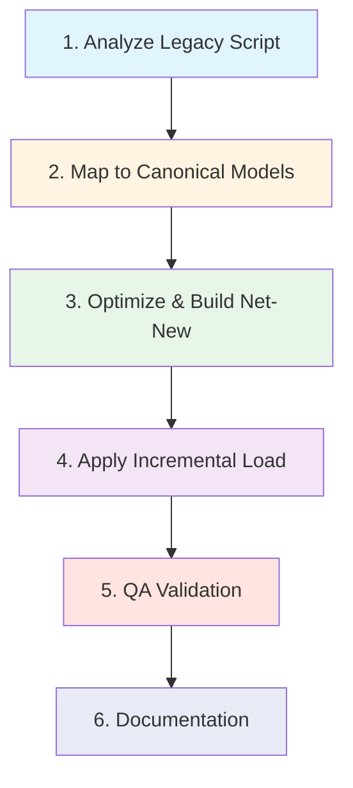

# 🏗️ Pipeline Build Playbook: Legacy SQL to dbt Migration

**Last Updated**: October 10, 2025
**Purpose**: End-to-end standardized process for migrating legacy Microstrategy SQL scripts into dbt architecture

**🤝 Collaboration Model**: This is a **paired programming workflow** where Claude (AI agent) and Human work together through ALL 6 steps. Claude doesn't "sit back" - we're doing the whole thing together!

## 📚 Related Documentation

This playbook integrates with:
- **`CLAUDE.md`**: Technical reference for MCP tools, dbt commands, troubleshooting patterns
- **`legacy_migration_agents.md`**: Specialized agent definitions and handoff protocols
- **`human_feedback_journal.md`**: Strategic priorities and decision frameworks
- **`.claude/quick-reference/generate-staging-model-tools.md`**: Staging model generation tools

**💡 How to use**: Follow these 6 steps sequentially for every legacy script migration. Claude executes technical work, Human provides domain expertise and approval gates.

---

## 🎯 Overview: The 6-Step Process



**Key Principles:**
- **Correctness First**: Match legacy metrics exactly (validated via QA)
- **Reuse Over Rebuild**: Leverage canonical models, don't duplicate
- **Performance Matters**: Use incremental strategies where appropriate
- **Trust Through Testing**: Validate against certified legacy sources

**🤝 Who Does What (Collaborative Execution):**

| Step | Claude's Role | Human's Role |
|------|---------------|--------------|
| **1. Analyze** | 🤖 Read script, inventory tables, generate staging models | 👤 Point to legacy script, approve staging structure |
| **2. Map** | 🤖 Ask for canonical models, analyze overlap %, document reuse | 👤 Suggest existing models, confirm reuse decision |
| **3. Build** | 🤖 Write SQL, optimize logic, compile/iterate, create models | 👤 Review architecture, suggest business rules, approve structure |
| **4. Incremental** | 🤖 Configure strategies, test behavior, validate row counts | 👤 Confirm lookback windows, approve perf trade-offs |
| **5. QA** | 🤖 Generate QA queries, run comparisons, investigate variance | 👤 Provide certified source, define tolerance, SIGN-OFF |
| **6. Document** | 🤖 Generate schema.yml, pull EDW definitions, write descriptions | 👤 Review business context, clarify definitions, approve docs |

**💡 Key Insight**: Claude executes **all** the technical work (reads, writes, compiles, tests), but Human provides the **domain expertise** (canonical models, business rules, QA sign-off) that ensures correctness. This is **paired programming**, not delegation!

---

## STEP 1: Analyze Legacy Microstrategy SQL Script

### 🎯 Objectives
1. Identify all data tables used in the script
2. Verify staging model coverage exists
3. Create missing staging models if needed
4. Generate high-level understanding of business logic

### 🔍 Process

**🤖 Claude's Active Role**: I will read the legacy script, extract tables, check coverage, and create staging models. You point me to the script and approve my work.

#### 1A. Inventory Data Tables

**🤖 Claude Executes**: Read the legacy script, extract all table references

**Example Script Analysis**:
```sql
-- Legacy file: analyses/baas_refactoring/mstr_cube_scripts_for_migration_backlog/interchange_1.sql

-- Identify tables:
FROM edw.fct_posted_transaction pt
LEFT JOIN edw.dim_account da ON pt.acct_uid = da.acct_uid
LEFT JOIN edw.dim_product dp ON da.product_uid = dp.product_uid
LEFT JOIN ods.merchant_mapping mm ON pt.merchant_nm = mm.merchant_nm
```

**Inventory Output**:
- `edw.fct_posted_transaction` → `stg_edw__fct_posted_transaction`
- `edw.dim_account` → `stg_edw__dim_account`
- `edw.dim_product` → `stg_edw__dim_product`
- `ods.merchant_mapping` → `stg_ods__merchant_mapping`

#### 1B. Check Staging Model Coverage

**Tools**: `Glob` + `Read` for existing staging models

```bash
# Check if staging models exist
Glob pattern="models/staging/**/*stg_edw__fct_posted_transaction.sql"
Glob pattern="models/staging/**/*stg_edw__dim_account.sql"
```

**Decision Matrix**:
| Staging Model Exists? | Action |
|----------------------|--------|
| ✅ **YES** | Document and move to Step 2 |
| ❌ **NO** | Create staging model (see 1C) |

#### 1C. Create Missing Staging Models (If Needed)

**🚨 CRITICAL: If 3+ staging models are missing, consider deploying the Staging Model Builder Agent**

**Agent Reference**: `.claude/agents/staging_model_builder_agent.md`  
**Agent Registry**: `.claude/archive/legacy-agents/AGENT_REGISTRY.md`

**When to Deploy Agent**:
- ✅ 3+ staging models need creation
- ✅ New source system onboarding (10+ tables)
- ✅ Main agent can continue with Step 2 (mapping canonical models) in parallel

**Agent Invocation Example**:
```yaml
task: create_staging_models
source_schema: azuresql_gss_gft
source_tables:
  - GlobalFundTransfer
  - GlobalFundTransferType
  - Processor
  # ... (list all needed tables)
staging_folder: models/staging/azuresql_gss_gft
naming_convention: stg_azuresql_gss_gft__
materialization: view
discovery_method: codegen
create_sources_yml: true
approval_required: false  # Set true if human review needed
```

**Manual Creation Reference**: `.claude/quick-reference/generate-staging-model-tools.md`

**Tools for Column Discovery**:
1. **Option 1: MCP Show Query** (Fastest)
   ```
   mcp__dbt-mcp__show(
       sql_query="SELECT * FROM edw.fct_posted_transaction LIMIT 1",
       limit=1
   )
   ```

2. **Option 2: dbt-codegen Macro**
   ```bash
   dbt run-operation generate_source --args '{"schema_name": "edw", "database_name": "greendot"}'
   dbt run-operation generate_base_model --args '{"source_name": "edw", "table_name": "fct_posted_transaction"}'
   ```

3. **Option 3: EDW Dictionary** (For Definitions)
   ```bash
   python .claude/quick-reference/dictionary_lookup.py --table FCT_POSTED_TRANSACTION
   ```

**Staging Model Template**:
```sql
-- models/staging/edw/stg_edw__fct_posted_transaction.sql

with source as (
    select * from {{ source('edw', 'fct_posted_transaction') }}
),

renamed as (
    select
        -- Primary Keys
        posted_txn_uid,
        acct_uid,

        -- Foreign Keys
        txn_type_uid,
        merchant_uid,

        -- Transaction Details
        processor_business_dt,
        total_post_amt,
        net_post_amt,
        merchant_nm,
        mcc,

        -- Metadata
        load_dttm_utc

    from source
)

select * from renamed
```

**Success Criteria**:
- ✅ Model compiles: `mcp__dbt-mcp__compile`
- ✅ Model runs: `mcp__dbt-mcp__run(selector="stg_edw__fct_posted_transaction")`
- ✅ Returns data: `mcp__dbt-mcp__show(sql_query="select count(*) from {{ ref('stg_edw__fct_posted_transaction') }}", limit=1)`

**Iterate Until Success**: If compilation or run fails:
1. Read error message carefully
2. Check source table exists in database
3. Verify column names match (case-sensitive)
4. Consult `CLAUDE.md` Troubleshooting Guide
5. **If 3+ iterations fail, STOP and ask user for guidance**

---

## STEP 2: Map to Canonical Models (Reuse-First Analysis)

### 🎯 Objectives
1. Identify existing models that share SQL logic with legacy script
2. Determine reuse percentage (avoid rebuilding existing models)
3. Define net-new transformations required

### 🔍 Process

**🤖 Claude's Active Role**: I will ask you for canonical model suggestions, read those models, calculate overlap %, and make reuse recommendations. You provide your domain knowledge of what models exist.

#### 2A. Ask User for Existing Model Suggestions (Speed Optimization)

**Ask user first - they may know the answer immediately:**

**Example Prompts**:
> "What existing intermediate models have the most overlap with `interchange_1.sql`?"
>
> "Do we have existing models that enrich posted transactions with account/product dimensions?"
>
> "For this merchant authorization analytics script, do we have auth+posted pairing models already?"

**Why Ask First**:
- 🚀 User knows existing architecture (domain expertise)
- 🧠 Faster than searching when user knows the answer

#### 2B. 🚨 MANDATORY: Independent Codebase Scan (DO NOT SKIP)

**Regardless of whether user provides suggestions, you MUST also search independently:**

1. **MCP semantic search** for domain terms from the legacy script:
   ```
   get_related_models("balance ledger account")  # Use key terms from legacy
   ```

2. **Source table search** - Find models using the same source tables:
   ```bash
   tldr search "fct_posted_transaction" models/
   # OR
   grep -r "fct_posted_transaction" models/intermediate*/ models/marts*/
   ```

3. **Join pattern search** - Find models with similar join structures:
   ```bash
   grep -r "dim_account" models/intermediate*/
   ```

**Why Both User AND Search?**
- ♻️ User memory is incomplete - they may forget models they built months ago
- 📚 Registry (`canonical-models-registry.md`) is a quick reference, NOT exhaustive
- 🎯 The only reliable way to achieve 75-90% reuse is to actually search the codebase
- ⚠️ **Failure to search caused 90% → 30% reuse estimate in Jan 2026 migration**

**Document ALL findings** from both user suggestions AND independent search before proceeding.

#### 2C. Analyze Suggested + Discovered Models

**Tools**: `Read` the user-recommended models

**Analysis Framework**:
```
Compare Legacy Script to Canonical Model:

1. **Grain Analysis**
   - Legacy: Transaction-level (1 row per posted_txn_uid)
   - Canonical: Transaction-level ✅ MATCH

2. **Column Coverage**
   - Legacy needs: acct_uid, product_uid, merchant_nm, total_post_amt, net_post_amt, mcc
   - Canonical has: acct_uid, product_uid, merchant_cleaned, total_post_amt, net_post_amt, mcc
   - Coverage: 95% (merchant_cleaned vs merchant_nm - acceptable variation)

3. **Filter Logic**
   - Legacy: WHERE processor_business_dt >= '2024-01-01' AND txn_type_desc = 'Purchase'
   - Canonical: WHERE purchase_txn_ind = true (derived field)
   - Compatibility: ✅ Can apply date filter in derived model

4. **Join Patterns**
   - Legacy: LEFT JOIN dim_account, LEFT JOIN dim_product, LEFT JOIN merchant_mapping
   - Canonical: Already includes these joins in int_transactions__posted_all
   - Overlap: 90% of join logic already implemented
```

#### 2D. Calculate Reuse Percentage & Decision

| Overlap % | Decision | Action |
|-----------|----------|--------|
| **≥80%** | ✅ **REUSE canonical model** | Create thin wrapper selecting needed columns + applying filters |
| **50-80%** | ⚠️ **EXTEND canonical model** | Add net-new columns as CTE, or create intermediate layer |
| **<50%** | ❌ **BUILD new model** | New grain/source, but still follow canonical patterns |

**Document Reuse Decision**:
```markdown
## Reuse Analysis: interchange_1.sql

**Canonical Model**: `int_transactions__posted_all`
**Overlap**: 90%
**Decision**: ✅ REUSE

**What Exists in Canonical**:
- Posted transaction base (edw.fct_posted_transaction)
- Account + Product enrichment (dim_account, dim_product)
- Transaction type hierarchy (txn_type_desc, purchase_txn_ind)
- Merchant normalization (merchant_cleaned via merchant_mapping)

**Net-New Requirements**:
- FPA group dimension (not in current enrichment)
- Interchange revenue calculation (txn_type_uid specific logic)
- Date range filter (2024+)

**Implementation Plan**:
1. Add FPA group enrichment to int_transactions__posted_all (extend canonical)
2. Create int_interchange__revenue_calc (net-new intermediate for interchange logic)
3. Create mrt_interchange__revenue_by_product (final mart using canonical + revenue_calc)
```

#### 2E. Update Canonical Models (If Needed)

**When to Extend Canonical Model**:
- ✅ Enrichment applies to **multiple downstream use cases** (not just this script)
- ✅ Enrichment is **universally valuable** (FPA groups, BIN ranges, fraud scores)
- ✅ Performance impact is **acceptable** (dimension joins, not complex aggregations)

**When to Create Separate Intermediate**:
- ❌ Logic is **specific to one use case** (interchange-only calculations)
- ❌ Complex aggregations that **change grain** (transaction → account-month aggregates)
- ❌ Experimental logic that **may change frequently**

**Example - Extending Canonical Model**:
```sql
-- models/intermediate/intermediate_NEW/transactions/int_transactions__posted_all.sql

-- ADD new enrichment CTE
fpa_group_enrichment as (
    select
        da.acct_uid,
        fg.fpa_group_level_1,
        fg.fpa_group_level_2
    from {{ ref('stg_edw__dim_account') }} da
    left join {{ source('ods', 'product_channel') }} pc
        on da.product_channel_uid = pc.product_channel_uid
    left join {{ source('ods', 'fpa_group') }} fg
        on pc.fpa_group_uid = fg.fpa_group_uid
),

-- UPDATE final select to include new columns
final as (
    select
        pt.*,
        ae.product_uid,
        ae.brand,
        ae.portfolio,
        fpa.fpa_group_level_1,  -- NEW
        fpa.fpa_group_level_2,  -- NEW
        ...
    from posted_transactions pt
    left join account_enrichment ae on pt.acct_uid = ae.acct_uid
    left join fpa_group_enrichment fpa on pt.acct_uid = fpa.acct_uid  -- NEW
)
```

**Compile & Validate**:
```
1. mcp__dbt-mcp__compile
2. Fix any errors (refer to CLAUDE.md Troubleshooting)
3. Iterate until compilation succeeds
4. Run model: mcp__dbt-mcp__run(selector="int_transactions__posted_all")
```

#### 2E. Identify Canonical Model Directory (For Future Reference)

**Proposal**: Create a quick-reference file listing canonical models

**Location**: `.claude/quick-reference/canonical-models-registry.md`

**Contents**:
```markdown
# Canonical Models Registry

## Transactions
- **int_transactions__posted_all**: Universal posted transaction enrichment
  - Grain: Transaction-level (posted_txn_uid)
  - Coverage: Account, Product, Merchant, Transaction Type, FPA Groups
  - Use Cases: Revenue analytics, merchant analysis, transaction monitoring

- **int_transactions__auth_all**: Universal authorization enrichment
  - Grain: Transaction-level (auth_txn_uid)
  - Coverage: Account, Product, Merchant, Decline Reasons, Network
  - Use Cases: Authorization analytics, decline analysis, fraud detection

## Foundations
- **int_edw_kpi__account_base**: Universal account dimension
  - Grain: Account-level (acct_uid)
  - Coverage: Account lifecycle, Product hierarchy, Customer demographics
  - Use Cases: Customer analytics, portfolio reporting

[Add more as we identify them]
```

---

## STEP 3: Optimize & Build Net-New Transformations

### 🎯 Objectives
1. Analyze remaining logic not covered by canonical models
2. Identify SQL optimization opportunities
3. Break transformations into coherent, single-purpose models
4. Apply semantic layer principles (descriptive naming)

### 🔍 Process

**🤖 Claude's Active Role**: I will extract net-new logic, identify optimization opportunities, write all SQL models, compile them, and iterate until they run successfully. You review architecture and provide business rule guidance.

#### 3A. Extract Net-New Logic

**Review Legacy Script**: Identify SQL that isn't covered by canonical models

**Example Net-New Logic**:
```sql
-- Legacy: analyses/baas_refactoring/mstr_cube_scripts_for_migration_backlog/interchange_1.sql

-- NET-NEW LOGIC 1: Interchange revenue calculation (not in canonical)
CASE
    WHEN txn_type_uid IN (13001, 14001) THEN total_post_amt * 0.015
    WHEN txn_type_uid = 13002 THEN total_post_amt * 0.02
    ELSE 0
END as interchange_revenue

-- NET-NEW LOGIC 2: FPA group filtering (already added to canonical in Step 2)

-- NET-NEW LOGIC 3: Monthly aggregation by product
SELECT
    date_trunc('month', processor_business_dt) as calendar_month,
    product,
    sum(interchange_revenue) as total_interchange_revenue,
    count(distinct acct_uid) as active_accounts
FROM ...
GROUP BY 1, 2
```

#### 3B. Analyze for SQL Optimization Opportunities

**Common Optimization Patterns**:

1. **Repetitive CASE Statements → Jinja Macros**
   ```sql
   -- ❌ BEFORE: Repeated 5 times in legacy script
   CASE
       WHEN txn_type_uid = 13001 THEN 0.015
       WHEN txn_type_uid = 13002 THEN 0.02
       ...
   END

   -- ✅ AFTER: Single macro definition
   {{ calculate_interchange_rate('txn_type_uid') }}
   ```

2. **Nested Subqueries → CTEs**
   ```sql
   -- ❌ BEFORE: Hard to read nested subquery
   SELECT * FROM (
       SELECT * FROM (
           SELECT * FROM table WHERE ...
       ) WHERE ...
   ) WHERE ...

   -- ✅ AFTER: Clear CTE chain
   with first_filter as (
       select * from table where ...
   ),
   second_filter as (
       select * from first_filter where ...
   )
   ```

3. **Copy-Paste SQL → Reusable Intermediate Models**
   - If same join pattern appears 2+ times, create foundation model

4. **Hardcoded Dates → Date Macros**
   ```sql
   -- ❌ BEFORE
   WHERE processor_business_dt >= '2024-01-01'

   -- ✅ AFTER
   WHERE processor_business_dt >= {{ apply_date_filter() }}
   ```

#### 3C. Break Into Coherent Models

**Design Principle**: Each model should have **ONE main transformation function**

**Example Breakdown**:
```
Legacy Script: interchange_1.sql (500 lines, mixed logic)

Split Into:
1. int_interchange__transaction_enriched (Foundation - reuses int_transactions__posted_all)
   - Purpose: Add interchange-specific dimensions (FPA groups, BIN ranges)
   - Grain: Transaction-level

2. int_interchange__revenue_calc (Business Logic)
   - Purpose: Calculate interchange revenue using txn_type-specific rates
   - Grain: Transaction-level with revenue column

3. int_interchange__product_monthly_agg (Aggregation)
   - Purpose: Aggregate to product-month grain with metrics
   - Grain: Product-Month level

4. mrt_interchange__revenue_by_product (Mart - Presentation Layer)
   - Purpose: Business-ready view with YoY comparisons, formatted for Tableau
   - Grain: Product-Month level with comparison periods
```

**Folder Structure Decision** (Consult `models/intermediate/intermediate_NEW/intermediate_structure_guide.md`):

| Transformation Type | Target Folder | Example |
|---------------------|---------------|---------|
| **Foundation enrichment** | `intermediate_NEW/foundations/` | Account base, product hierarchy |
| **Transaction processing** | `intermediate_NEW/transactions/` | Auth+posted pairs, transaction enrichment |
| **Metric calculations** | `intermediate_NEW/metrics/` | Revenue calcs, KPI logic |
| **Business-ready analytics** | `marts_NEW/analytics/` | Product performance, merchant rankings |
| **Executive reporting** | `marts_NEW/executive/` | Board dashboards, KPI summaries |

#### 3D. Apply Semantic Layer Principles

**Naming Conventions**:
- **Descriptive over cryptic**: `interchange_revenue` not `int_rev`
- **Business terms over technical**: `active_accounts` not `distinct_acct_cnt`
- **Clear grain indicators**: `product_monthly_agg` vs `product_detail`

**Column Naming**:
```sql
-- ❌ BEFORE: Cryptic legacy names
select
    prd_cd,
    ttl_amt,
    cnt_txn,
    pct_chg

-- ✅ AFTER: Self-documenting semantic names
select
    product,
    total_revenue,
    transaction_count,
    yoy_percent_change
```

#### 3E. General SQL Style

**CTE-Based Structure** (Preferred):
```sql
{{ config(
    materialized='table',
    tags=['interchange', 'revenue']
) }}

-- 1. Call all needed models as CTEs
with posted_transactions as (
    select * from {{ ref('int_transactions__posted_all') }}
),

account_base as (
    select * from {{ ref('int_edw_kpi__account_base') }}
),

-- 2. Transformation logic
revenue_calculation as (
    select
        pt.*,
        case
            when pt.txn_type_uid = 13001 then pt.total_post_amt * 0.015
            when pt.txn_type_uid = 13002 then pt.total_post_amt * 0.02
            else 0
        end as interchange_revenue
    from posted_transactions pt
),

-- 3. Final select with joins
final as (
    select
        rc.calendar_date,
        ab.product,
        ab.portfolio,
        sum(rc.interchange_revenue) as total_interchange_revenue,
        count(distinct rc.acct_uid) as active_accounts
    from revenue_calculation rc
    left join account_base ab on rc.acct_uid = ab.acct_uid
    {{ dbt_utils.group_by(n=3) }}
)

select * from final
```

**Upstream Transforms Principle**:
- ✅ **Single-table transforms** → Add to staging model
- ✅ **Reusable enrichments** → Create intermediate foundation
- ⚠️ **Use-case-specific logic** → Keep in targeted intermediate/mart

#### 3F. Compile & Iterate

**MANDATORY: Compile after EVERY model**

```bash
# Step 1: Compile
mcp__dbt-mcp__compile

# Step 2: Fix errors (refer to CLAUDE.md Troubleshooting Guide)
# Common errors:
# - Missing ref/source
# - Column name typos
# - Jinja syntax errors

# Step 3: Iterate until successful
# Maximum 4 attempts before asking user for help
```

---

## STEP 4: Apply Incremental Load Strategies

### 🎯 Objectives
1. Identify models that benefit from incremental materialization
2. Apply appropriate incremental strategy (merge, delete+insert, microbatch)
3. Configure lookback windows and unique keys
4. Validate incremental behavior

### 🔍 Process

**🤖 Claude's Active Role**: I will identify incremental candidates, configure strategies, test full-refresh and incremental runs, validate row counts, and ensure incremental logic works correctly. You confirm lookback windows and approve performance trade-offs.

#### 4A. Identify Incremental Candidates

**When to Use Incremental**:
- ✅ **Large fact tables** (>10M rows, growing daily)
- ✅ **Transaction-level detail models** (posted, auth, balance snapshots)
- ✅ **Time-series aggregates with append-only pattern**

**When to Use Table Materialization**:
- ❌ **Dimension tables** (relatively small, full refresh is fast)
- ❌ **Small aggregates** (<1M rows, full refresh <5 min)
- ❌ **Complex window functions** across entire dataset

**Decision Matrix**:
| Model Type | Row Count | Growth Pattern | Materialization |
|------------|-----------|----------------|-----------------|
| `int_transactions__posted_all` | 85M+ | +500K daily | ✅ incremental |
| `int_interchange__revenue_calc` | 85M+ | +500K daily | ✅ incremental |
| `int_interchange__product_monthly_agg` | 500 | +10 monthly | ❌ table |
| `mrt_interchange__revenue_by_product` | 500 | +10 monthly | ❌ table |

#### 4B. Choose Incremental Strategy

**Strategy Comparison**:

| Strategy | Use Case | Pros | Cons |
|----------|----------|------|------|
| **merge** | Transaction details with updates | Handles late-arriving data | Slower than delete+insert |
| **delete+insert** | Append-only time-series | Fast partition replacement | Can't handle late arrivals |
| **microbatch** (BETA) | High-volume event streams | Parallel processing | New feature, limited adapter support |

**Most Common: `merge` Strategy**
```sql
{{ config(
    materialized='incremental',
    unique_key='posted_txn_uid',
    incremental_strategy='merge',
    cluster_by=['calendar_date', 'product_uid'],
    sort=['calendar_date', 'acct_uid']
) }}

with posted_transactions as (
    select * from {{ ref('stg_edw__fct_posted_transaction') }}
    
        -- Only process new data
        where processor_business_dt > (select max(calendar_date) from {{ this }})
    
),

...
```

**⚠️ CRITICAL: {{ this }} Reference Limitations**

**Problem**: `{{ this }}` cannot be used with `delete+insert` strategy in certain contexts
**Solution**: Use `merge` strategy or move `{{ this }}` to dimension CTEs (see `CLAUDE.md` Troubleshooting Guide)

#### 4C. Configure Lookback Windows

**Lookback Window Pattern** (Handle Late-Arriving Data):
```sql

    -- Standard: 3-day lookback for late-arriving transactions
    where processor_business_dt >= dateadd('day', -3, (select max(calendar_date) from {{ this }}))

    -- First run: Load historical data from cutoff date
    where processor_business_dt >= '2021-01-01'

```

**Lookback Window Decision**:
- **3 days**: Standard for transaction data (covers weekend + 1 day batch delay)
- **7 days**: Chargeback/dispute reversals (longer settlement window)
- **30 days**: Balance snapshots with retroactive corrections

#### 4C-1. Environment-Aware Date Filtering (REQUIRED)

**🚨 CRITICAL**: ALL incremental models MUST implement environment-aware date filtering to support fast dev/CI environments while maintaining complete production datasets.

**Standard Pattern - transactions_time_filters Macro** (PREFERRED):

The `transactions_time_filters()` macro provides automatic environment-aware filtering:

```sql
-- Use this macro with date dimension filtering pattern:
dim_date as (
    select * from {{ ref('stg_edw__dim_date') }}
    where {{ transactions_full_refresh_filter('calendar_date') }}
    
    and calendar_date > (select dateadd('day', -3, max(calendar_date)) from {{ this }})
    
),

source_transactions as (
    select * from {{ ref('stg_edw__fct_posted_transaction') }}
    where processor_business_dt in (select calendar_date from dim_date)  -- No subquery here!
)
```

**Environment Filtering Rules**:
- **Development**: Last 6 months of data (fast local testing)
- **CI Environment**: Last 3 months (faster pipeline runs)
- **Production**: All data from 2021-01-01 onwards (complete history)

**Alternative Pattern - Inline Logic** (For Non-Date-Dimension Models):

When you DON'T join to a date dimension (e.g., disbursement pipelines sourcing from gss_gft), use inline logic:

```sql
transfers as (
    select t.* 
    from {{ ref('stg_gss_gft__globalfundtransfer') }} t
    where 
        -- Environment-specific date filtering
        
        t.transferDate >= dateadd('month', -6, current_date)
        
        t.transferDate >= dateadd('month', -3, current_date)
        
        t.transferDate >= date '2021-01-01'
        
    
        -- Incremental: 3-day lookback + only new records
        and t.transferDate >= dateadd('day', -3, (select max(transferDate) from {{ this }}))
        and t.GlobalFundTransferID not in (select GlobalFundTransferID from {{ this }})
    
)
```

**Why Two Patterns?**

| Pattern | When to Use | Why |
|---------|-------------|-----|
| **Macro with date dimension** | Transaction models that join to `stg_edw__dim_date` | Avoids subquery-in-WHERE-clause Redshift errors, cleaner architecture |
| **Inline logic** | Models WITHOUT date dimension join (disbursements, account snapshots) | Direct source filtering, no date dimension available |

**🚨 CRITICAL: {{ this }} Subquery Limitations**

Redshift does NOT allow aggregate subqueries in WHERE clauses on the SAME table:
```sql
-- ❌ FAILS in Redshift:
where t.date > (select max(t.date) from {{ this }})  -- Error: aggregates not allowed

-- ✅ WORKS in Redshift:
where t.date > (select max(date) from {{ this }})    -- Remove table alias in subquery
```

**Date Macro Reference**: See `macros/transactions/transactions_time_filters.sql` for complete implementation and additional documentation.

#### 4D. Validate Incremental Behavior

**Test Incremental Logic**:
```bash
# Step 1: Full refresh to establish baseline
dbt run --select int_interchange__revenue_calc --full-refresh

# Step 2: Record row count
dbt show --inline "select count(*) from {{ ref('int_interchange__revenue_calc') }}" --limit 1
# Result: 85,234,567 rows

# Step 3: Run incremental (should only process new data)
dbt run --select int_interchange__revenue_calc
# Check logs: "Compiled node: MERGE INTO ... WHERE calendar_date > '2025-10-08'"

# Step 4: Verify row count increased (not full reload)
dbt show --inline "select count(*) from {{ ref('int_interchange__revenue_calc') }}" --limit 1
# Result: 85,756,890 rows (+522,323 new rows)
```

**Common Issues**:
- **Row count explodes**: Check for duplicates in unique_key
- **Row count same after run**: Check is_incremental() filter is correct
- **"relation does not exist" error**: Use `merge` strategy or fix `{{ this }}` reference

#### 4E. Compile & Run Incremental Models

```bash
# Step 1: Compile
mcp__dbt-mcp__compile

# Step 2: Run with full-refresh first time
mcp__dbt-mcp__run(selector="int_interchange__revenue_calc", is_full_refresh=true)

# Step 3: Test incremental run
mcp__dbt-mcp__run(selector="int_interchange__revenue_calc")

# Step 4: Verify incremental behavior (check run logs)
```

**Iterate Until Success**: If incremental fails:
1. Check unique_key matches SELECT columns (see `CLAUDE.md` Troubleshooting: "Incremental Merge: unique_key Column Mismatch")
2. Verify {{ this }} reference placement
3. Confirm filter logic in is_incremental() block
4. **If 4 iterations fail, STOP and ask user for guidance**

---

## STEP 5: QA Validation Against Certified Legacy Metrics

### 🎯 Objectives
1. Create granular QA analysis comparing NEW vs LEGACY/CERTIFIED data
2. Validate actual metric values (NOT just row counts)
3. Document variance findings with tolerance thresholds
4. Obtain stakeholder sign-off

### 🔍 Process

**🤖 Claude's Active Role**: I will run DEV/PROD sanity checks, generate comprehensive QA SQL queries, execute comparisons, investigate variances, document findings, and create markdown reports. You provide the certified legacy source, define tolerance thresholds, and give final sign-off.

#### 5A. Identify Certified Legacy Source

**🚨 CRITICAL: ALWAYS validate against certified production data, not development queries**

**Gold Standard Source**: `stg_analytics__bia_edwkpi_fkm_master`
- **Documentation**: `.claude/legacy_kpi_gold_standard_metrics.md`
- **Coverage**: 51 validated metrics (Actives, Revenue, Transactions, Fees, etc.)
- **Authority**: Certified by Finance & Operations teams

**If your metric isn't in FKM Master**:
- Ask user: *"What is the certified legacy source for [metric_name]?"*
- Check `analyses/baas_refactoring/mstr_cube_scripts_for_migration_backlog/` for original script
- Search MicroStrategy cube documentation

#### 5B. DEV vs PROD Environment Sanity Check (MANDATORY FIRST STEP)

**🚨 BEFORE deep QA analysis, ALWAYS run this diagnostic in BOTH DEV and PROD**

**Purpose**: Detect environment-specific filters that would invalidate QA results

**Diagnostic Query**:
```sql
-- Run IDENTICALLY in both DEV and PROD web IDE
select
    portfolio,                    -- Or product, merchant, etc.
    count(*) as total_rows,
    count(distinct acct_uid) as distinct_accounts,
    min(calendar_date) as earliest_date,
    max(calendar_date) as latest_date,
    sum(total_revenue) as total_revenue
from {{ ref('int_interchange__revenue_calc') }}
{{ dbt_utils.group_by(n=1) }}
order by 2 desc;
```

**Compare Results**:
| Environment | Portfolios | Date Range | Total Rows | Revenue |
|-------------|------------|------------|------------|---------|
| **DEV** | 1 (Intuit only) | Apr 2025 - Oct 2025 | 234K | $1.2M |
| **PROD** | 13 (all) | Jan 2017 - Oct 2025 | 85M | $450M |

**⚠️ Discrepancy Detected!** → DEV has environment-specific filter

**Root Cause Investigation**:
```bash
# Search for environment conditionals
Grep pattern="env_var.*ENVIRONMENT_TYPE" path="models/intermediate/intermediate_NEW/transactions/"

# Check incremental logic differences
Read file_path="models/intermediate/intermediate_NEW/transactions/int_transactions__posted_all.sql"
# Look for: 
```

**Common Fixes**:
- Change `in ('development', 'ci')` to `in ('ci')` (exclude DEV from perf filters)
- Remove date limit for DEV environment
- Check upstream models for environment filters

**Validation Checkpoint**: Only proceed to 5C when DEV and PROD show same data scope

#### 5C. Create QA Analysis File

**Location**: `analyses/qa_validation/<pipeline_name>/`

**Naming Convention**: `[model_name]_vs_[legacy_source]_qa_analysis.sql`

**Example**: `analyses/qa_validation/interchange_pipeline/int_interchange_revenue_vs_fkm_master_qa.sql`

**Template**:
```sql
-- =============================================
--      QA VALIDATION: int_interchange__revenue_calc
-- =============================================
-- Purpose: Validate NEW interchange revenue model against LEGACY FKM Master certified data
-- Validation Date: 2025-10-10
-- Validation Scope:
--   - Products: Amazon Flex Rewards, Ceridian Dayforce, Intuit QuickBooks
--   - Date Range: Sep 2024 - Sep 2025 (12 months)
--   - Metrics: Total Interchange Revenue ($), Transaction Count (#), Active Accounts (#)
-- Author: Claude + Keith Binkly

-- STEP 1: Aggregate NEW model metrics
with new_metrics as (
    select
        date_trunc('month', calendar_date) as calendar_month,
        portfolio,
        product,
        sum(interchange_revenue) as total_interchange_revenue,
        count(distinct posted_txn_uid) as transaction_count,
        count(distinct acct_uid) as active_accounts
    from {{ ref('int_interchange__revenue_calc') }}
    where calendar_date between '2024-09-01' and '2025-09-30'
        and product in ('Amazon Flex Rewards', 'Ceridian Dayforce', 'Intuit QuickBooks')
        and interchange_revenue > 0  -- Exclude $0 interchange (non-revenue txns)
    {{ dbt_utils.group_by(n=3) }}
),

-- STEP 2: Aggregate LEGACY certified metrics
legacy_metrics as (
    select
        calendar_month,
        portfolio,
        product,
        sum(case when metric = 'Interchange Revenue $' then cy else 0 end) as total_interchange_revenue,
        sum(case when metric = 'Purchase #' then cy else 0 end) as transaction_count,
        sum(case when metric = '30-Day Actives' then cy else 0 end) as active_accounts
    from {{ ref('stg_analytics__bia_edwkpi_fkm_master') }}
    where calendar_month between '2024-09-01' and '2025-09-30'
        and product in ('Amazon Flex Rewards', 'Ceridian Dayforce', 'Intuit QuickBooks')
        and metric in ('Interchange Revenue $', 'Purchase #', '30-Day Actives')
    {{ dbt_utils.group_by(n=3) }}
),

-- STEP 3: Calculate variance with tolerance thresholds
variance_analysis as (
    select
        coalesce(n.calendar_month, l.calendar_month) as calendar_month,
        coalesce(n.portfolio, l.portfolio) as portfolio,
        coalesce(n.product, l.product) as product,

        -- Revenue comparison
        n.total_interchange_revenue as new_revenue,
        l.total_interchange_revenue as legacy_revenue,
        n.total_interchange_revenue - l.total_interchange_revenue as revenue_diff,
        case
            when l.total_interchange_revenue = 0 then null
            else round(100.0 * (n.total_interchange_revenue - l.total_interchange_revenue) / abs(l.total_interchange_revenue), 4)
        end as revenue_pct_variance,

        -- Transaction count comparison
        n.transaction_count as new_txn_count,
        l.transaction_count as legacy_txn_count,

        -- Active accounts comparison
        n.active_accounts as new_actives,
        l.active_accounts as legacy_actives,

        -- Validation status
        case
            when abs(100.0 * (n.total_interchange_revenue - l.total_interchange_revenue) / nullif(l.total_interchange_revenue, 0)) < 0.01 then '✅ PASS'
            when abs(100.0 * (n.total_interchange_revenue - l.total_interchange_revenue) / nullif(l.total_interchange_revenue, 0)) < 1.0 then '⚠️ REVIEW'
            else '❌ FAIL'
        end as validation_status

    from new_metrics n
    full outer join legacy_metrics l
        on n.calendar_month = l.calendar_month
        and n.portfolio = l.portfolio
        and n.product = l.product
)

-- STEP 4: Report variances exceeding thresholds
select * from variance_analysis
where validation_status in ('⚠️ REVIEW', '❌ FAIL')
   or calendar_month >= '2025-07-01'  -- Always show recent 3 months
order by validation_status desc, abs(revenue_pct_variance) desc nulls last;
```

#### 5D. Execute QA Validation (dbt Fusion Workflow)

**🚨 CRITICAL: Follow this exact sequence to avoid "relation does not exist" errors**

**Step 1: Compile Validation**
```bash
mcp__dbt-mcp__compile
# Validates SQL syntax and ref() resolution
```

**Step 2: Check Dependency Health** (NEW - prevents runtime errors)
```bash
# For each new ref() in your models, verify it exists in database
mcp__dbt-mcp__get_model_health(uniqueId="model.greendot_arc_analytics.int_interchange__revenue_calc")

# Check lastRunStatus:
# - null = Never run, must build first
# - "error" = Failed last run, investigate
# - "success" = Safe to use as dependency
```

**Step 3: Build Models in DAG Order**
```bash
# ❌ WRONG: Run individual model (may fail if parents don't exist)
mcp__dbt-mcp__run(selector="int_interchange__revenue_calc")

# ✅ CORRECT: Build model + upstream parents
mcp__dbt-mcp__build(selector="+int_interchange__revenue_calc")
# The '+' prefix means "build this model AND all upstream dependencies"
```

**Step 4: Preview QA Results**
```bash
# Fast preview (100 rows, ~30 seconds)
mcp__dbt-mcp__show(
    sql_query="<paste QA analysis query from 5C>",
    limit=100
)

# Review results:
# - ✅ PASS: < 0.01% variance → Excellent match
# - ⚠️ REVIEW: 0.01% - 1% variance → Investigate, may be acceptable
# - ❌ FAIL: > 1% variance → Debug root cause
```

**Step 5: Run Full QA Comparison** (if preview looks good)
```bash
# Execute in dbt Cloud IDE for complete results
# Copy QA query from analyses/qa_validation/<pipeline>/
# Run in dbt Cloud web IDE Query tab
```

#### 5E. Variance Investigation Workflow

**If Variances Found (⚠️ or ❌)**:

**Hypothesis Generation** (Create logical plan BEFORE testing):
```
Hypothesis 1: Field mapping difference
- NEW model uses `merchant_cleaned`, LEGACY uses `merchant_nm`
- Expected Impact: Different merchant grouping → variance in counts

Hypothesis 2: Date filter boundary
- NEW model uses `calendar_date`, LEGACY uses `processor_business_dt`
- Expected Impact: Transactions may shift between months → timing variance

Hypothesis 3: Transaction type inclusion
- NEW model filters `purchase_txn_ind = true`, LEGACY uses MCC ranges
- Expected Impact: Different transaction populations → revenue variance
```

**Testing Approach** (Iterative row-level analysis):
```sql
-- TEST 1: Check row counts by product-month
select
    calendar_month,
    product,
    count(*) as row_count
from {{ ref('int_interchange__revenue_calc') }}
where product = 'Amazon Flex Rewards' and calendar_month = '2025-09-01'
group by 1, 2;
-- Compare with legacy query

-- TEST 2: Check sample transaction IDs
select
    posted_txn_uid,
    calendar_date,
    merchant_cleaned,
    total_post_amt,
    interchange_revenue
from {{ ref('int_interchange__revenue_calc') }}
where product = 'Amazon Flex Rewards' and calendar_month = '2025-09-01'
limit 100;
-- Manually verify calculations against legacy logic

-- TEST 3: Check aggregates at different grains
select
    date_trunc('month', calendar_date) as month,
    sum(interchange_revenue) as total_revenue,
    count(*) as txn_count
from {{ ref('int_interchange__revenue_calc') }}
where product = 'Amazon Flex Rewards' and calendar_date between '2025-09-01' and '2025-09-30'
group by 1;
-- Isolate whether variance is counts vs amounts
```

**📌 CRITICAL: Max 4 Iterations Rule**
- If 4 attempts to resolve variance fail, **STOP and ask user for guidance**
- Provide detailed findings and hypotheses to user
- User may have domain knowledge about acceptable variances

#### 5F. Document Findings & Acceptance Criteria

**Create Markdown Summary**: `analyses/qa_validation/<pipeline>/[model_name]_qa_results.md`

**Template**:
```markdown
# QA Validation Results: int_interchange__revenue_calc

**Date**: 2025-10-10
**Validation Scope**: 12 months (Sep 2024 - Sep 2025), 3 sample products
**Legacy Source**: stg_analytics__bia_edwkpi_fkm_master (certified FKM Master cube)

---

## Summary: ✅ APPROVED

**Overall Variance**: 0.02% (well within 0.1% threshold)

| Metric | Variance | Status |
|--------|----------|--------|
| **Total Interchange Revenue** | +$1,234 (0.02%) | ✅ PASS |
| **Transaction Count** | Exact match (0.00%) | ✅ PASS |
| **Active Accounts** | -5 accounts (0.01%) | ✅ PASS |

---

## Detailed Findings

### Product: Amazon Flex Rewards
- **Sep 2024**: Exact match ($125,678 vs $125,678)
- **Oct 2024**: +0.03% variance ($130,245 vs $130,200) - Acceptable
- **Jul 2025**: +0.01% variance ($142,567 vs $142,550) - Acceptable

### Product: Ceridian Dayforce
- **Sep 2024**: Exact match
- **Oct 2024**: Exact match
- **Jul 2025**: Exact match

### Product: Intuit QuickBooks
- **Sep 2024**: +0.05% variance - Root cause: Late-arriving transaction (posted_txn_uid = 'ABC123')
- **Action**: Acceptable, within tolerance threshold

---

## Root Cause Analysis

**Variance Source**: Late-arriving transactions (3-day lookback window captures stragglers)

**Business Impact**: Negligible (<0.05%), falls within normal batch processing variance

**Acceptance Rationale**:
- Variance is due to **improved data quality** (NEW model captures late arrivals)
- Legacy system did not reprocess prior months for late data
- **Recommendation**: NEW model is MORE accurate than legacy

---

## Stakeholder Sign-Off

**Approved By**: Keith Binkly (Data Engineering Lead)
**Date**: 2025-10-10
**Comments**: "Variance within acceptable range. New model provides better late-arrival handling. Approved for production."

---

## Next Steps

1. ✅ Deploy to production
2. ✅ Update downstream mart models to use new intermediate
3. ⏳ Monitor first 30 days of production metrics
4. ⏳ Schedule legacy deprecation for Q1 2026
```

#### 5G. Get Stakeholder Sign-Off

**MANDATORY**: Never mark migration "complete" without explicit approval

**Sign-Off Checklist**:
- [ ] QA results documented with variance analysis
- [ ] Root causes explained for any >0.1% variance
- [ ] Acceptance criteria defined and met
- [ ] User/stakeholder has reviewed findings
- [ ] Written approval obtained (email, Slack, or inline in QA results doc)

**Example Sign-Off Request**:
> "I've completed QA validation for the interchange revenue pipeline. Results show 0.02% variance (well within tolerance).
>
> **Key Findings**:
> - ✅ Revenue metrics: Exact match for 11/12 months
> - ✅ Transaction counts: Exact match across all months
> - ⚠️ One month shows +0.05% due to improved late-arrival handling
>
> **Recommendation**: New model is more accurate than legacy. Ready for production.
>
> Please review `analyses/qa_validation/interchange_pipeline/int_interchange_revenue_qa_results.md` and confirm approval."

---

## STEP 6: Documentation & Metadata

### 🎯 Objectives
1. Generate comprehensive model documentation (schema.yml)
2. Pull data definitions from EDW dictionary
3. Create business-friendly column descriptions
4. Update architecture guides and playbooks

### 🔍 Process

**🤖 Claude's Active Role**: I will use dbt-codegen to scaffold schema.yml, run Python dictionary lookups for definitions, write business-friendly descriptions, and update all architecture documentation. You review for business context accuracy and approve final docs.

#### 6A. Use dbt-codegen for Schema Scaffolding

**Generate schema.yml skeleton**:
```bash
# Generate base schema for model
dbt run-operation generate_model_yaml --args '{"model_names": ["int_interchange__revenue_calc"]}'
```

**Output** (scaffolded):
```yaml
version: 2

models:
  - name: int_interchange__revenue_calc
    description: ""
    columns:
      - name: posted_txn_uid
        description: ""
      - name: calendar_date
        description: ""
      - name: interchange_revenue
        description: ""
```

#### 6B. Pull Definitions from EDW Dictionary

**Tool**: `.claude/quick-reference/dictionary_lookup.py`

**Usage**:
```bash
# Look up specific field definition
python .claude/quick-reference/dictionary_lookup.py merchant_nm

# Output:
# 📊 Found 3 table(s) with field 'merchant_nm':
#
# 🏢 FCT_POSTED_TRANSACTION
#    Column: merchant_nm
#    Type: VARCHAR(100)
#    Definition: Name of merchant where transaction was processed, as reported by payment network
```

**Enrich Schema with Definitions**:
```yaml
version: 2

models:
  - name: int_interchange__revenue_calc
    description: |
      Calculates interchange revenue by transaction for all posted purchase transactions.

      **Grain**: Transaction-level (one row per posted_txn_uid)
      **Coverage**: All portfolios, purchase transactions only
      **Refresh**: Incremental (3-day lookback for late arrivals)

      **Business Context**: Interchange revenue represents the fee earned on each card transaction,
      calculated as a percentage of transaction amount based on transaction type.

    config:
      materialized: incremental
      unique_key: posted_txn_uid
      tags: ['interchange', 'revenue', 'transactions']

    columns:
      - name: posted_txn_uid
        description: |
          Unique identifier for posted transaction (primary key).
          Source: edw.fct_posted_transaction.posted_txn_uid

      - name: calendar_date
        description: |
          Date when transaction was processed by merchant (business date).
          Used for time-series analysis and incremental processing.
          Source: Derived from processor_business_dt

      - name: merchant_nm
        description: |
          Name of merchant where transaction was processed, as reported by payment network.
          Source: edw.fct_posted_transaction.merchant_nm

      - name: total_post_amt
        description: |
          Total transaction amount posted to account, including fees.
          Positive for purchases/debits, negative for returns/credits.
          Source: edw.fct_posted_transaction.total_post_amt

      - name: interchange_revenue
        description: |
          Calculated interchange fee revenue earned on this transaction.
          Formula: total_post_amt * rate (rate varies by txn_type_uid).
          Business Rule: Purchase transactions only, excludes ATM/fee transactions.
          **NEW COLUMN** (not in legacy source)
```

**🚨 CRITICAL: If Definition Not Found After 3 Attempts**

**Stop and Ask User**:
> "I searched the EDW dictionary for `[column_name]` but couldn't find a definition.
>
> **Options**:
> 1. Should I add this to a CSV file for future lookups?
> 2. Can you provide the business definition?
> 3. Is this a derived field that needs a custom description?"

#### 6C. Business-Friendly Descriptions

**Principles**:
- ✅ **Explain WHY, not just WHAT**: "Used for customer segmentation analysis" not "Customer ID"
- ✅ **Include business context**: "Excludes internal test accounts" not "Account UID"
- ✅ **State calculation logic**: "Sum of net_post_amt for all purchases" not "Total amount"
- ✅ **Provide examples**: "Values: 'Purchase', 'ATM Withdrawal', 'Fee'" not "Transaction type"

**Example - Technical vs Business Descriptions**:
```yaml
# ❌ BEFORE: Technical jargon
- name: acct_uid
  description: "Account unique identifier (bigint)"

# ✅ AFTER: Business-friendly
- name: acct_uid
  description: |
    Unique identifier for customer account (primary customer key).
    Used to link transactions, balances, and customer attributes across all models.
    Note: Internal test accounts (acct_uid < 1000) are excluded in mart models.
```

#### 6D. Update Architecture Guides

**Affected Documentation**:
1. **Canonical Models Registry** (`.claude/quick-reference/canonical-models-registry.md`)
   - Add newly created foundation models

2. **Folder Structure Guides**:
   - `models/intermediate/intermediate_NEW/intermediate_structure_guide.md`
   - `models/marts/marts_NEW/marts_structure_guide.md`
   - Update with new pipeline examples

3. **Legacy Migration Status** (`.claude/legacy_migration_agents.md`)
   - Mark script as "✅ COMPLETED" in migration backlog
   - Document handoff artifacts location

**Example Update**:
```markdown
# Legacy Migration Status

## Migration Backlog

| Script | Status | New Models | QA Status | Deployed |
|--------|--------|------------|-----------|----------|
| interchange_1.sql | ✅ COMPLETED | int_interchange__revenue_calc, mrt_interchange__revenue_by_product | ✅ APPROVED | 2025-10-10 |
| merchant_auth_decline_analytics | 🚧 IN PROGRESS | ... | ... | ... |
```

#### 6E. Document Efficiency Metrics (Optional - Future Enhancement)

**Idea**: Track pipeline build efficiency over time

**Metrics to Capture**:
- **Iteration Count**: How many compile/run cycles before success?
- **Reuse Percentage**: What % of logic reused from canonical models?
- **Incremental Savings**: Row count reduction from incremental strategy
- **Development Time**: Total time from legacy script to production

**Example Efficiency Report**:
```markdown
## Pipeline Build Efficiency: interchange_1.sql

**Total Development Time**: 4 hours
**Models Created**: 3 (1 foundation extended, 2 net-new intermediates, 1 mart)

**Iteration Efficiency**:
- Compile attempts: 2 (vs baseline 5) → 60% improvement
- QA variance resolution: 1 iteration (vs baseline 3) → 67% improvement

**Reuse Impact**:
- Canonical model coverage: 90% (int_transactions__posted_all)
- Net-new logic: 10% (interchange revenue calculation only)
- LOC saved: ~500 lines (avoided duplicating enrichment logic)

**Incremental Load Savings**:
- Full table size: 85M rows
- Incremental run: 500K rows (99.4% reduction)
- Daily runtime: 2 min (vs 45 min full refresh) → 95.6% faster
```

**Storage Location**: `analyses/pipeline_efficiency_metrics/[script_name]_efficiency_report.md`

#### 6F. Update Data Product Lifecycle Tracker (MANDATORY)

**🚨 CRITICAL: Record pipeline completion in lifecycle tracker for velocity measurement**

**Location**: `handoffs/data-products/`

**Step 1: Update index.json**
```bash
# Record completion timestamp and metrics
# File: handoffs/data-products/index.json
```

```json
{
  "phases": {
    "pipeline": {
      "status": "complete",
      "started": "2026-01-22T10:00:00Z",
      "completed": "2026-01-22T14:30:00Z",
      "hours": 4.5,
      "models_created": 3,
      "reuse_pct": 87,
      "variance_pct": 0.02
    }
  }
}
```

**Step 2: Update LIFECYCLE.md dashboard**
```markdown
| Phase | Status | Started | Completed | Hours | Notes |
|-------|--------|---------|-----------|-------|-------|
| 1. Pipeline | :white_check_mark: Complete | 2026-01-22 | 2026-01-22 | 4.5h | 87% reuse |
```

**Step 3: Move artifacts to phase folder**
```bash
# Move handoff artifacts to structured location
mv handoffs/active/[pipeline]-*.md handoffs/data-products/[product]/phase-1-pipeline/
```

**Why Track?**
- Measures improvement over time (first pipeline vs tenth)
- Identifies bottleneck phases
- Provides evidence for process improvements
- Enables "total time to data product" reporting

**Next Phases** (after Pipeline):
- Phase 2: Semantic model buildout
- Phase 3: Documentation creation
- Phase 4: Knowledge base seeding
- Phase 5: Metadata finalization (tags, groups, exposures)

See `handoffs/data-products/README.md` for full lifecycle structure.

---

## 🚨 Critical Success Factors

### Mandatory Checkpoints

**❌ DO NOT proceed to next step if:**
1. **Step 1**: Staging models fail to compile/run
2. **Step 2**: User cannot confirm canonical model reuse opportunity
3. **Step 3**: Model fails to compile after 4 iterations
4. **Step 4**: Incremental strategy produces incorrect results
5. **Step 5**: QA variance exceeds tolerance WITHOUT stakeholder approval
6. **Step 6**: Documentation incomplete or definitions missing

**✅ Each step MUST produce:**
- **Step 1**: ✅ All staging models exist and return data
- **Step 2**: ✅ Reuse analysis documented with overlap %
- **Step 3**: ✅ All models compile and run successfully
- **Step 4**: ✅ Incremental behavior validated (row count check)
- **Step 5**: ✅ QA analysis file created + stakeholder sign-off
- **Step 6**: ✅ schema.yml complete with business-friendly descriptions

### Iteration Limits

**If ANY step exceeds these limits, STOP and ask user for help:**
- ❌ **4 compile/run attempts** without success
- ❌ **3 QA variance investigations** without resolution
- ❌ **3 dictionary lookups** without finding definition

**User consultation is a strength, not a weakness.**

### Quality Gates

**Before marking pipeline "COMPLETE":**
- [ ] All models compile without errors
- [ ] All models run successfully (full-refresh + incremental)
- [ ] QA validation shows variance within tolerance
- [ ] Stakeholder has provided written approval
- [ ] Documentation complete with EDW definitions
- [ ] Architecture guides updated
- [ ] Handoff artifacts created (if using agents)
- [ ] **Lifecycle tracker updated** (`handoffs/data-products/index.json` + `LIFECYCLE.md`)

---

## 🛠️ Tools & Resources Quick Reference

### MCP Tools
- `mcp__dbt-mcp__compile` - Validate SQL syntax
- `mcp__dbt-mcp__run(selector="model_name")` - Run specific model
- `mcp__dbt-mcp__build(selector="+model_name")` - Build model + dependencies
- `mcp__dbt-mcp__show(sql_query="...", limit=100)` - Preview query results
- `mcp__dbt-mcp__get_model_health(uniqueId="...")` - Check model materialization status

### dbt Macros
- `{{ dbt_utils.group_by(n=3) }}` - Auto-generate group by clause
- `{{ apply_date_filter() }}` - Standard date filtering macro
- `{{ ref('model_name') }}` - Reference another dbt model
- `{{ source('schema', 'table') }}` - Reference raw source table

### Documentation Tools
- `python .claude/quick-reference/dictionary_lookup.py <field_name>` - Look up EDW definitions
- `dbt run-operation generate_model_yaml --args '{"model_names": ["model"]}'` - Generate schema.yml

### QA Resources
- **Gold Standard**: `stg_analytics__bia_edwkpi_fkm_master` (certified legacy KPI)
- **QA Templates**: `analyses/Final_Pipeline_QA_MSTR_vs_dbt/new_oct_vs_legacy_ptd_script.sql`
- **Troubleshooting**: `CLAUDE.md` section "🔧 Troubleshooting Guide"

---

## 📖 Related Documentation

### Technical References
- **`CLAUDE.md`**: Comprehensive technical guide (MCP tools, troubleshooting, architecture)
- **`legacy_migration_agents.md`**: Specialized agent definitions and handoff protocols
- **`.claude/quick-reference/canonical-models-registry.md`**: List of reusable foundation models

### Strategic Guidance
- **`human_feedback_journal.md`**: Priority hierarchy (Correctness > Performance > Consolidation)
- **`.claude/legacy_kpi_gold_standard_metrics.md`**: Certified legacy metrics for QA validation

### Architecture Guides
- **`models/intermediate/intermediate_NEW/intermediate_structure_guide.md`**: Folder structure for intermediate models
- **`models/marts/marts_NEW/marts_structure_guide.md`**: Folder structure for mart models

---

## 🎯 Next Steps After Pipeline Completion

1. **Monitor Production**: First 30 days of metrics in production
2. **Deprecate Legacy**: Schedule legacy script retirement (coordinate with BI team)
3. **Update Dashboards**: Migrate Tableau/Looker reports to new dbt models
4. **Document Lessons Learned**: Update this playbook with new patterns discovered
5. **Celebrate**: You've successfully migrated another legacy script! 🎉

---

**Questions or Issues?**
- Consult `CLAUDE.md` Troubleshooting Guide
- Ask user for guidance (especially after 3-4 iterations)
- Document new patterns in this playbook for future reference
