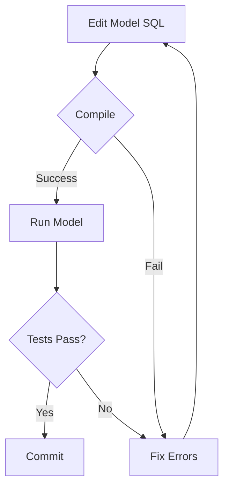

# 🚨 MANDATORY RULE: Compile After Every Script Change

**Status**: ZERO TOLERANCE - No Exceptions  
**Applies To**: ALL dbt model changes (SQL, config, Jinja)  
**Last Updated**: 2025-11-06

---

## The Rule

### ✅ DO THIS (Every Time)
```bash
# 1. Make changes to model file(s)
vim models/.../model.sql

# 2. COMPILE FIRST (MANDATORY!)
dbt compile --select model_name

# 3. ONLY if compile succeeds → run
dbt run --select model_name
```

### ❌ NEVER DO THIS
```bash
# ❌ WRONG: Running without compiling
vim models/.../model.sql
dbt run --select model_name  # DON'T DO THIS!
```

---

## Why This is Mandatory

### Cost & Time Savings
- ✅ Compile: **5-10 seconds, FREE**
- ❌ Failed warehouse run: **2-5 minutes, COSTS MONEY**
- 💰 ROI: 12-30x time savings per error

### What Compile Catches
1. **Syntax Errors**: Invalid SQL, missing commas, typos
2. **Column Mismatches**: `column 'x' does not exist`, type casting issues
3. **JOIN Errors**: Table aliases, ambiguous columns, missing ON clauses
4. **GROUP BY Errors**: Aggregate columns in GROUP BY, wrong position counts
5. **SORTKEY/DISTKEY Errors**: Column name mismatches (Fusion specific)
6. **Macro Errors**: Undefined macros, wrong arguments, Jinja syntax
7. **Reference Errors**: `ref()` to non-existent models

### What Compile Doesn't Catch (Warehouse Only)
1. **Data Quality**: NULL values, type conversion failures at runtime
2. **Performance**: Slow queries, missing indexes
3. **Schema Evolution**: `on_schema_change` column additions
4. **Incremental Logic**: Date filter edge cases

---

## Command Patterns

### Single Model
```bash
dbt compile --select model_name
dbt run --select model_name
```

### Multiple Models
```bash
dbt compile --select model1 model2 model3
dbt run --select model1 model2 model3
```

### Full Dependency Tree
```bash
dbt compile --select +model_name  # All upstream
dbt run --select +model_name --full-refresh
```

### Tagged Models
```bash
dbt compile --select tag:interchange
dbt run --select tag:interchange
```

### Directory
```bash
dbt compile --select models/intermediate/transactions/*
dbt run --select models/intermediate/transactions/*
```

---

## Integration with Workflow

### Standard Development Loop


### QA Validation Workflow
```bash
# 1. Pre-flight: Compile all models
dbt compile --select +mart_name

# 2. Build dependencies
dbt run --select +mart_name --exclude mart_name

# 3. Compile target (verify dependencies worked)
dbt compile --select mart_name

# 4. Build target
dbt run --select mart_name

# 5. Run QA queries
```

---

## Enforcement Checklist

Before EVERY `dbt run`, verify:
- [ ] All modified files saved
- [ ] `dbt compile --select <models>` executed
- [ ] Compile output reviewed (no errors/unexpected warnings)
- [ ] Compile succeeded (green checkmark)
- [ ] ONLY THEN proceed to `dbt run`

---

## Session Learning Example (2025-11-06)

### ❌ Violation
- Made 6 file modifications (SORTKEY fix, GROUP BY fixes, JOIN addition)
- Ran `dbt run` immediately after each change
- Hit 3 warehouse errors:
  1. SORTKEY column name mismatch
  2. GROUP BY counting aggregate columns
  3. Missing JOIN for sor_group

**Impact**: 
- 3 failed warehouse runs (~5 minutes wasted)
- 3 compile cycles could have caught all errors (~30 seconds)
- **ROI**: 10x time savings if compiled first

### ✅ Correct Approach (Applied After Learning)
```bash
# After all fixes applied
dbt compile --select int_transactions__posted_all \
    int_interchange__revenue_details \
    int_interchange__revenue_aggregated \
    int_interchange__posted_aggregated \
    mart_interchange__monthly_dossier

# Result: All 5 models compiled successfully in 8 seconds
# Then: Successful warehouse runs
```

---

## Exception Handling

**Q: Are there any exceptions to this rule?**  
**A: NO.**

**Q: What if it's a tiny change like a comment?**  
**A: Still compile. Takes 5 seconds, builds good habits.**

**Q: What if I'm in a hurry?**  
**A: Compiling is FASTER than fixing warehouse errors.**

**Q: What if compile is slow (30+ seconds)?**  
**A: Still faster than failed warehouse run (2-5 minutes).**

**Q: What about dbt Cloud CI/CD?**  
**A: CI will compile, but YOU should too before committing.**

---

## Related Documentation

- Session Log: `session-logs/2025-11-06_interchange_qa_learnings.md`
- QA Workflow: `shared/reference/qa-validation-checklist.md`
- Troubleshooting: `shared/knowledge-base/troubleshooting.md`

---

**Remember**: 
- 🚀 Compile = 5-10 seconds
- 💰 Failed run = 2-5 minutes + cost
- ✅ Always compile first = Faster + Cheaper + Better

**Zero tolerance. No exceptions.**
